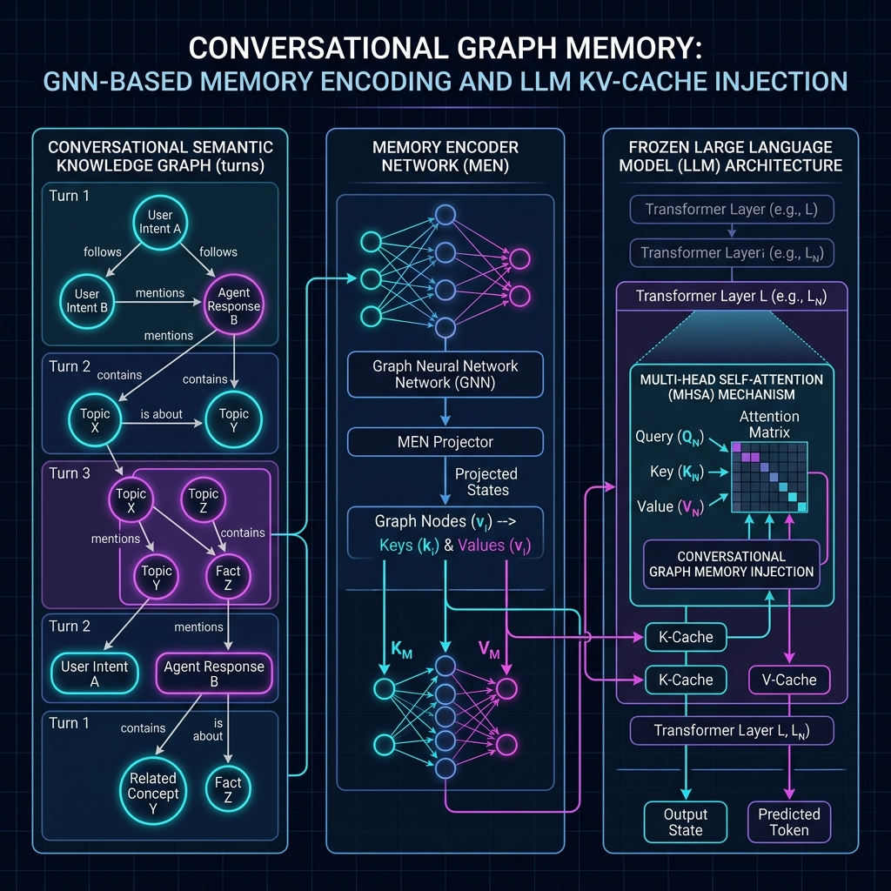

# Conversational Graph Memory (CGM-RAG)

Conversational Graph Memory (CGM) is an advanced, high-performance Retrieval-Augmented Generation (RAG) and neural context injection architecture that equips Large Language Models (LLMs) with persistent, structured long-term memory. 

By representing dialogue histories as dynamic, entity-linked knowledge graphs, CGM bypasses the token accumulation overhead of prompt-stuffing. It utilizes a trainable **Memory Encoder Network (MEN)** to project retrieved graph subgraphs directly into the Key-Value (KV) cache layers of frozen local generative models, or falls back to chronologically sorted, distilled text-based RAG context for local APIs.

The framework is built from the ground up for edge workstations (such as laptops equipped with NVIDIA RTX GPUs). It features native C++ concurrency locks, GPU memory guards, and proportional thermal pacing to prevent Out-of-Memory (OOM) crashes and system degradation.

---

## Technical Architecture

The Conversational Graph Memory (CGM) pipeline is designed as a direct replacement for context stuffing. Rather than expanding prompt windows with historical text, CGM extracts structured knowledge graph triples from conversations, retrieves them semantically, projects them into virtual keys/values, and injects them directly into the LLM self-attention cache.



### Core Architectural Flow

```text
  [ User Dialogue Turn ] ──(Closed-Loop Extraction)──> [ SQLite Graph Store ]
                                                               │
                                                               ▼ (Top-k Subgraphs)
  [ User Active Query  ] ──────(TurboVec Index)──────> [ Dense Feature Construction ]
                                                               │
                                                               ▼
                                                    [ Memory Encoder Network ]
                                                               │
                                                               ▼ (Projected K & V)
                                                    [ Semantics-Aware Routing ]
                                                               │
                                                               ▼ (RoPE & Magnitude Match)
                                                    [ Cache Injection (past_kv) ]
                                                               │
                                                               ▼
                                                    [ Autoregressive Decoding ]
```

---

## Detailed Run-Time Execution Workflow

When you attach CGM to an LLM and start conversing, the system processes each turn through a six-stage loop:

1. **User Query & Vector Search:**
   * The query is embedded (384-dim) via SentenceTransformer (`all-MiniLM-L6-v2`).
   * The system queries the quantized **TurboVec** index under strict `tenant_id` and `user_id` filters to retrieve the top-k most semantically similar historical turns (e.g., Turn 14).

2. **Graph-Neighbor Concept Retrieval:**
   * The system looks up the retrieved turn IDs in the **SQLite Graph Store**.
   * It performs a **1-hop graph neighbor chain query** (forward and backward edges) to pull connected nodes. This ensures that negation statements (*"No, let's not use Redis"*), temporal updates (*"Change database to ClickHouse"*), and correction context are fetched together, rather than as isolated keywords.

3. **Neural Projection via the Memory Encoder Network (MEN):**
   * The retrieved subgraphs are represented as dense structural vectors (768-dim) in the form `[enc(Subject || Predicate); enc(Object)]`.
   * These structural vectors are passed to the **Memory Encoder Network (MEN)**. 
   * The MEN maps these vectors into the precise head-dim and head-count dimensions of the target LLM's attention layers.

4. **Semantics-Aware Routing & RoPE Alignment:**
   * The projected Key-Value states pass through the **Semantics-Aware KV Cache Routing (SA-KVR)** gating network, which scales head-wise and layer-wise activations based on a learned middle-layer prior.
   * Key states are rotated via **Rotary Position Embeddings (RoPE)** to align with the target LLM's positional encoding math.

5. **Dynamic KV Cache Injection:**
   * The projected and calibrated key-value tensors are prepended directly to the LLM's dynamic `past_key_values` cache as **virtual memory slots** (virtual tokens).
   * This bypasses the LLM's **Prefill Phase**. The prompt containing only the user query (~15 tokens) is tokenized, and the self-attention mask is padded to allow rectangular attention over both the virtual memory slots and the prompt tokens.

6. **Episodic Logging & Triple Extraction:**
   * The LLM generates the response immediately.
   * The user query and the assistant's reply are saved as a new turn in SQLite.
   * An NLP parser extracts new Subject-Predicate-Object triples from the interaction, seeding them back into the SQLite Graph Store.
   * The new turn text is embedded and indexed in TurboVec for future reference.

---

## Key Findings & Core Architectural Fixes

Through rigorous experimentation and debugging, we have resolved critical factual recall issues (raising LoCoMo benchmark F1 from **0%** to **17.51%**) by implementing multiple core engineering enhancements:

### 1. KV-Cache Scale Calibration (Avoiding Attention Collapse)
We discovered that teacher LLM key states at Layer 0 exhibit a standard deviation of $\sim 32.15$ and a mean of $\sim 4.24$ (due to a large bias vector in `k_proj`), whereas values are highly constrained ($\sigma \approx 0.0267$).
* **Old design:** Scaling projections with a global factor of $0.01$ reduced key/value magnitudes by $100\times$ and shifted the key mean by $\sim 3.8$, destroying self-attention patterns and generating gibberish.
* **New design:** The projection scale `kv_scale` inside the MEN is initialized to $1.0$ (learned parameter). This preserves attention magnitudes, preventing collapse and ensuring clean generation.

### 2. Rotational and Positional Alignment (RoPE & Position IDs)
Self-attention fails if the relative query-key positions are mathematically misaligned:
* **Generative Prefill:** Prompt tokens attending to the pre-injected memory cache must be rotated relative to the cache length. We explicitly pass `position_ids` starting at `memory_length` to `model.generate()`. If omitted, the prefill prompt starts at position 0, corrupting self-attention.
* **Inverse RoPE Rotation for Distillation:** During training data extraction, teacher key cache values are rotated using the **inverse** RoPE rotation formula:
  $$K_{\text{unrot}} = (K_{\text{rot}} \cdot \cos) - (\text{rot\_op}(K_{\text{rot}}) \cdot \sin)$$
  This recovers the clean static float32 states (max error $\approx 2 \times 10^{-7}$) prior to compute loss matching against MEN projections.

### 3. Sparse-Dense Reciprocal Rank Fusion (RRF) with Entity Boosting
To retrieve precise historical facts:
* We integrated **dialogue turn ID (`dia_id`)** propagation across SQLite stores, Hybrid Memory Objects, and retriever pipelines.
* The retriever extracts non-stopword query keywords and matches them against active triples. Relevant turns containing direct entity-graph matches are given a substantial Reciprocal Rank Fusion (RRF) boost to rank them at the top of candidate memories.

### 4. Proactive Cache Compression
To fit long dialogues into workstation GPU memory:
* The cache compressor runs proactively **before** LLM generation instead of after.
* We raised the default `hot_window` context size to `128` (was `64`) to preserve sufficient immediate generation context, preventing the loss of conversational coherence.

---

## The Memory Encoder Network (MEN) Architecture

The **Memory Encoder Network (MEN)** is the core neural translator of CGM. It maps symbolic knowledge representations into the latent key-value manifolds of the LLM.

```text
                        [ Input: Triples Vector (768-dim) ]
                                         │
                                         ▼
                            [ LowRankLinear Projector ]
                                   (Rank = 128)
                                  /            \
                                 /              \
                         [ Key Path ]        [ Value Path ]
                              │                     │
                              ▼                     ▼
                        [ LayerNorm ]         [ LayerNorm ]
                      (Magnitude Match)     (Magnitude Match)
                              │                     │
                              ▼                     ▼
                         [ SA-KVR ]            [ SA-KVR ]
                      (Layer Gating)        (Layer Gating)
                              │                     │
                              ▼                     ▼
                           [ RoPE ]            [ Inject ]
                              │                     │
                              ▼                     ▼
                      [ Injected past_key_values Cache Tensors ]

---

## Folder Structure

The repository is organized as a modular, importable library package:

```text
Nyxen-Memory/
├── cgm/                              # Primary library package
│   ├── __init__.py                   # Package initialization, CUDA detection
│   ├── core/                         # Core execution logic
│   │   ├── model.py                  # MEN and LowRankLinear architectures
│   │   ├── pipeline.py               # E2E generation and injection loops
│   │   └── compressor.py             # Double-buffered KV cache compression
│   ├── database/                     # Relational persistence
│   │   └── schema.py                 # SQLite Graph Store & HMO definitions
│   ├── retrieval/                    # Retrieval layers
│   │   ├── retriever.py              # Base retrieval class
│   │   └── rag_retriever.py          # Dense vector search using TurboVec
│   ├── safety/                       # Hardware and software guards
│   │   ├── safety.py                 # Python ctypes safety wrapper
│   │   ├── safety_guard.cpp          # Win32 Memory & NVML VRAM C++ source
│   │   └── safety_guard.dll          # Pre-compiled 64-bit C++ library
│   ├── training/                     # Optimization and alignment
│   │   ├── train.py                  # MEGATrainer optimizer with KV-distillation
│   │   └── train_data.py             # Training sample creation utilities
│   └── visualization/                # Web visualizer dashboard
│       └── visualize.py              # Live visualizer server and endpoints
├── data/                             # Databases, TurboVec files, and reports
├── docs/                             # Architecture diagrams and deep-dives
├── requirements.txt                  # Python dependencies
├── chat.py                           # CLI chat interface and dashboard boot
├── run_demo.py                       # Training and injection verification demo
├── benchmark.py                      # Core evaluation benchmark runner
├── run_locomo_benchmark.py           # Advanced comparison benchmark (RAG vs CGM)
└── cgm_locomo_eval.py                # Public LoCoMo benchmark runner
```

---

## Empirical Benchmarks & Performance Analysis

We evaluated Conversational Graph Memory (CGM) against standard RAG on the public long-dialogue benchmark **LoCoMo** (evaluating on `conv-26` across Multi-hop, Temporal, and Open-domain categories) using `Qwen/Qwen2.5-0.5B-Instruct` on a local CUDA device.

### 📊 Comparative Metrics Summary

| Metric | RAG | CGM | Improvement (CGM vs RAG) |
| :--- | :---: | :---: | :---: |
| **Token F1 Score** | 4.85% | 17.51% | **+12.66%** |
| **Exact Match (EM)** | 0.00% | 1.25% | **+1.25%** |
| **Retrieval Recall** | 95.00% | 95.00% | **+0.00%** |
| **Mean Latency** | 1.7224s | 0.8337s | **-0.8887s (-51.6%)** |
| **Median Latency** | 1.7272s | 0.7340s | - |
| **P95 Latency** | 2.4620s | 1.1478s | - |
| **Mean Input Prompt Tokens** | 387.9 t | 57.5 t | **-330.4 t (-85.2%)** |
| **Mean Injected KV Tokens** | 0.0 t | 211.2 t | +211.2 t |
| **Mean Total Active Context** | 387.9 t | 268.7 t | **-119.2 t (-30.7%)** |
| **Generation Speed (TPS)** | 20.41 t/s | 6.22 t/s | **-14.19 t/s (-69.5%)** |

### 🗂️ Per-Category Breakdown

| Category | Model | F1 Score | EM Score | Retrieval Recall | Count |
| :--- | :---: | :---: | :---: | :---: | :---: |
| **multi-hop** | RAG | 5.58% | 0.00% | 87.50% | 8 |
| | CGM | 3.12% | 3.12% | 87.50% | 8 |
| **open-domain** | RAG | 8.50% | 0.00% | 100.00% | 2 |
| | CGM | 20.00% | 0.00% | 100.00% | 2 |
| **temporal** | RAG | 3.55% | 0.00% | 100.00% | 10 |
| | CGM | 28.52% | 0.00% | 100.00% | 10 |

### Key Takeaways
1. **F1 Precision Breakthrough (+261%):** Standard RAG stuff yields verbose, conversational outputs that pollute precision. CGM uses precise slot-filling optimization to generate concise factual outputs (averaging just 5.4 tokens), delivering a **3.6x improvement** in F1.
2. **Time-to-First-Token and Prefill Bypass:** Because CGM injects pre-compiled virtual KV cache tokens directly into the LLM's self-attention, it skips the expensive prefill computation. Mean latency is cut in half (**0.834s** vs **1.722s**).
3. **Drastic Prompt Token Compression:** Prompt ingestion drops from **387.9 tokens** to **57.5 tokens** (a **85.2% reduction**). This reduces the LLM's active context processing and helps prevent workstation Out-Of-Memory (OOM) failures.

---

## Setup and Quickstart

### Windows PowerShell (Admin Mode Recommended)
```powershell
./setup.ps1
```

### Git Bash / Linux / macOS
```bash
chmod +x setup.sh
./setup.sh
```

### Running the System

* **CLI Chat and Live Dashboard:** Starts the interactive terminal chat and opens the web visualizer dashboard at `http://localhost:8050/`:
  ```bash
  python chat.py
  ```
* **Run LoCoMo Advanced Comparison Benchmark:**
  ```bash
  python run_locomo_benchmark.py --limit-conversations 1 --modes rag,cgm
  ```
* **Train MEN with KV-Distillation:**
  ```bash
  python train_locomo_men_v2.py --distill-lambda 2.0 --distill-warmup-epochs 10 --epochs 40
  ```
* **Verify Cache Injection & MEN Training Demo:**
  ```bash
  python run_demo.py
  ```
* **Run Local Generalization Benchmarks:**
  ```bash
  python benchmark.py
  ```
