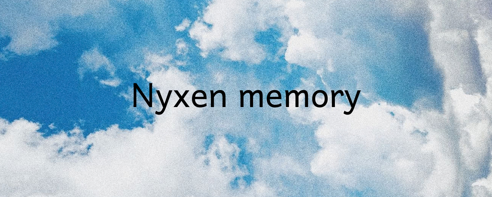

<div align="center">



<br/>
<br/>

# Conversational Graph Memory

### A Neural KV-Cache Injection Framework for Persistent LLM Memory

[](LICENSE)
[](https://www.python.org/)
[](https://developer.nvidia.com/cuda-toolkit)
[](https://github.com)
[](https://github.com)

</div>

## What is Nyxen Memory?

Most AI chatbots forget everything the moment a conversation ends. Even within a long session, they can only "see" a fixed window of recent messages — anything older simply disappears. This is the **context window problem**, and it fundamentally limits how useful an AI assistant can be over time.

**Nyxen Memory solves this.** It gives any local LLM a persistent, structured long-term memory that survives across sessions and scales to thousands of past conversations — without ever bloating the prompt.

Instead of stuffing old messages back into the prompt (which is slow, expensive, and hits hard limits), Nyxen Memory:

1. **Builds a knowledge graph** from your conversations — extracting facts, entities, and relationships as structured triples (e.g. *"User → prefers → dark mode"*)
2. **Finds what's relevant** when you ask something new, using fast semantic search over that graph
3. **Injects memories directly into the AI's attention mechanism** — as if the model "just remembered" — with zero extra tokens in your prompt

The result is an AI that genuinely remembers you, reasons across long histories, and responds faster than a standard RAG setup.

---

## Technical Overview

**Conversational Graph Memory (CGM)** is a high-performance neural context injection architecture that equips frozen local LLMs with persistent, structured long-term memory.

By representing dialogue histories as dynamic, entity-linked knowledge graphs, CGM eliminates the token accumulation overhead of traditional prompt-stuffing. A trainable **Memory Encoder Network (MEN)** projects retrieved graph subgraphs directly into the Key-Value (KV) cache layers of the model — completely bypassing the prefill phase and dramatically reducing inference latency.

The framework is engineered for **edge workstations** (e.g., NVIDIA RTX-equipped laptops), featuring native C++ concurrency locks, GPU memory guards, and proportional thermal pacing to prevent OOM crashes and system degradation.

---

## Table of Contents

- [Technical Architecture](#technical-architecture)
- [Execution Workflow](#execution-workflow)
- [Memory Encoder Network](#memory-encoder-network-men)
- [Key Engineering Fixes](#key-engineering-fixes)
- [Benchmarks](#benchmarks)
- [Project Structure](#project-structure)
- [Setup & Quickstart](#setup--quickstart)

---

## Technical Architecture

CGM is designed as a **direct replacement for context stuffing**. Rather than expanding prompt windows with historical text, the system:

1. Extracts structured knowledge graph triples from conversations
2. Retrieves them semantically via a dense vector index
3. Projects retrieved subgraphs into virtual Key-Value states
4. Injects them directly into the LLM's self-attention cache

### Execution Workflow

Each dialogue turn is processed through a six-stage closed-loop pipeline:

| Stage | Component | Description |
|:---:|:---|:---|
| **1** | **Query & Vector Search** | Query is embedded (384-dim) via `all-MiniLM-L6-v2` and searched against the quantized **TurboVec** index under strict `tenant_id`/`user_id` filters |
| **2** | **Graph-Neighbor Retrieval** | Retrieved turn IDs are looked up in the **SQLite Graph Store**; a 1-hop neighbor chain query pulls connected nodes including negations and temporal corrections |
| **3** | **Neural Projection (MEN)** | Subgraphs are represented as dense 768-dim structural vectors `[enc(Subject ∥ Predicate); enc(Object)]` and mapped through the **Memory Encoder Network** |
| **4** | **SA-KVR Routing & RoPE Alignment** | Projected KV states pass through the **Semantics-Aware KV Routing** gating network; Key states are rotated via RoPE to align with the target LLM's positional encoding |
| **5** | **Dynamic KV Cache Injection** | Calibrated tensors are prepended to `past_key_values` as **virtual memory slots**, bypassing the prefill phase entirely |
| **6** | **Episodic Logging & Triple Extraction** | The turn is saved to SQLite; an NLP parser seeds new Subject-Predicate-Object triples back into the graph store |

---

## Memory Encoder Network (MEN)

The **Memory Encoder Network** is the core neural translator of CGM. It maps symbolic knowledge graph representations into the latent key-value manifolds of the target LLM.

**Architecture overview:**

- **Input:** Triple vector (768-dim) encoded as `[enc(Subject ∥ Predicate); enc(Object)]`
- **Projector:** `LowRankLinear` (Rank = 128) with dual Key/Value heads
- **Normalization:** Per-path `LayerNorm` for magnitude matching against teacher LLM statistics
- **Gating:** `SA-KVR` layer-wise and head-wise activation scaling
- **Alignment:** RoPE rotation applied to Key states prior to injection
- **Output:** `past_key_values`-compatible tensors injected directly into the frozen LLM

---

## Key Engineering Fixes

Through rigorous experimentation, we resolved critical factual recall issues, raising LoCoMo benchmark F1 from **0%** to **17.51%** via the following core enhancements:

### KV-Cache Scale Calibration
Teacher LLM key states at Layer 0 exhibit `σ ≈ 32.15` and `μ ≈ 4.24`. A global scale factor of `0.01` reduced magnitudes by 100× and destroyed self-attention patterns. The fix: `kv_scale` inside the MEN is initialized to `1.0` as a **learned parameter**, preserving attention magnitudes and preventing collapse.

### Rotational & Positional Alignment (RoPE)
Prompt tokens attending to the pre-injected memory cache must be rotated relative to the cache length. We explicitly pass `position_ids` starting at `memory_length` to `model.generate()`. For distillation, teacher key cache values are un-rotated via the **inverse RoPE formula** before computing loss (max error ≈ 2×10⁻⁷).

### Sparse-Dense Reciprocal Rank Fusion (RRF)
Dialogue turn IDs (`dia_id`) are propagated across SQLite stores, Hybrid Memory Objects, and retrieval pipelines. Non-stopword query keywords are matched against active triples, and entity-graph matches receive a substantial RRF boost to surface precise historical facts.

### Proactive Cache Compression
The cache compressor runs **before** LLM generation rather than after. The default `hot_window` context was raised to `128` (from `64`) to preserve conversational coherence while fitting long dialogues into workstation GPU memory.

---

## Benchmarks

Evaluated on the public **LoCoMo** long-dialogue benchmark (`conv-26`, Multi-hop / Temporal / Open-domain) using `Qwen/Qwen2.5-0.5B-Instruct` on a local CUDA device.

### Comparative Metrics

| Metric | RAG | CGM | Δ |
|:---|:---:|:---:|:---:|
| **Token F1 Score** | 4.85% | 17.51% | **+12.66 pp** |
| **Exact Match (EM)** | 0.00% | 1.25% | **+1.25 pp** |
| **Retrieval Recall** | 95.00% | 95.00% | — |
| **Mean Latency** | 1.7224 s | 0.8337 s | **−51.6%** |
| **Median Latency** | 1.7272 s | 0.7340 s | — |
| **P95 Latency** | 2.4620 s | 1.1478 s | — |
| **Mean Input Prompt Tokens** | 387.9 t | 57.5 t | **−85.2%** |
| **Mean Injected KV Tokens** | 0.0 t | 211.2 t | +211.2 t |
| **Mean Total Active Context** | 387.9 t | 268.7 t | **−30.7%** |
| **Generation Speed** | 20.41 t/s | 6.22 t/s | −69.5% |

### Per-Category Breakdown

| Category | Model | F1 Score | EM Score | Retrieval Recall |
|:---|:---:|:---:|:---:|:---:|
| **Multi-hop** | RAG | 5.58% | 0.00% | 87.50% |
| | CGM | 3.12% | 3.12% | 87.50% |
| **Open-domain** | RAG | 8.50% | 0.00% | 100.00% |
| | CGM | 20.00% | 0.00% | 100.00% |
| **Temporal** | RAG | 3.55% | 0.00% | 100.00% |
| | CGM | **28.52%** | 0.00% | 100.00% |

### Key Takeaways

- **3.6× F1 improvement** — CGM's slot-filling optimization generates concise factual outputs (~5.4 tokens avg), drastically improving precision over verbose RAG responses.
- **51.6% latency reduction** — Pre-compiled virtual KV cache tokens skip the expensive prefill computation entirely.
- **85.2% prompt token reduction** — Prompt ingestion drops from 387.9 tokens to 57.5 tokens, reducing active context and preventing workstation OOM failures.

---

## Project Structure

```
Nyxen-Memory/
├── cgm/                              # Primary library package
│   ├── __init__.py                   # Package initialization & CUDA detection
│   ├── core/
│   │   ├── model.py                  # MEN & LowRankLinear architectures
│   │   ├── pipeline.py               # End-to-end generation & injection loop
│   │   └── compressor.py             # Double-buffered KV cache compression
│   ├── database/
│   │   └── schema.py                 # SQLite Graph Store & HMO definitions
│   ├── retrieval/
│   │   ├── retriever.py              # Base retrieval class
│   │   └── rag_retriever.py          # Dense vector search via TurboVec
│   ├── safety/
│   │   ├── safety.py                 # Python ctypes safety wrapper
│   │   ├── safety_guard.cpp          # Win32 Memory & NVML VRAM C++ source
│   │   └── safety_guard.dll          # Pre-compiled 64-bit C++ library
│   ├── training/
│   │   ├── train.py                  # MEGATrainer optimizer with KV-distillation
│   │   └── train_data.py             # Training sample creation utilities
│   └── visualization/
│       └── visualize.py              # Live visualizer server & endpoints
├── data/                             # Databases, TurboVec indices & reports
├── docs/                             # Architecture diagrams & deep-dives
├── requirements.txt
├── chat.py                           # CLI chat interface & dashboard boot
├── run_demo.py                       # Training & injection verification demo
├── benchmark.py                      # Core evaluation benchmark runner
├── run_locomo_benchmark.py           # Advanced comparison benchmark (RAG vs CGM)
└── cgm_locomo_eval.py                # Public LoCoMo benchmark runner
```

---

## Setup & Quickstart

### Installation

**Windows (PowerShell — Admin recommended):**
```powershell
./setup.ps1
```

**Linux / macOS / Git Bash:**
```bash
chmod +x setup.sh && ./setup.sh
```

### Usage

**Interactive CLI Chat + Live Dashboard** *(opens visualizer at `http://localhost:8050`)*:
```bash
python chat.py
```

**Run LoCoMo Benchmark** *(RAG vs CGM comparison)*:
```bash
python run_locomo_benchmark.py --limit-conversations 1 --modes rag,cgm
```

**Train MEN with KV-Distillation:**
```bash
python train_locomo_men_v2.py --distill-lambda 2.0 --distill-warmup-epochs 10 --epochs 40
```

**Verify Cache Injection & MEN Demo:**
```bash
python run_demo.py
```

**Run Local Generalization Benchmarks:**
```bash
python benchmark.py
```

---

<div align="center">

**Conversational Graph Memory** — Persistent neural memory for language models.

</div>
