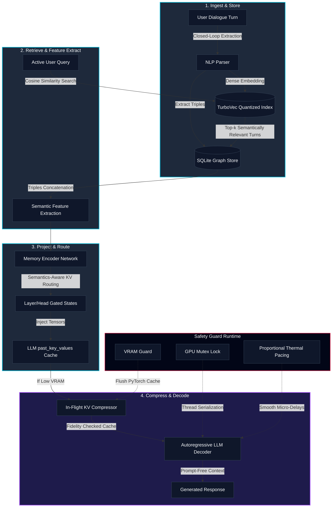

# Conversational Graph Memory (CGM-RAG)

Conversational Graph Memory (CGM) is an advanced RAG (Retrieval-Augmented Generation) and context compression architecture that enhances Large Language Models with persistent, structured long-term memory. By representing dialogue histories as dynamic knowledge graphs, CGM avoids the token overhead of prompt-stuffing. It uses a trainable Memory Encoder Network (MEN) to project retrieved graph concepts directly into the Key-Value (KV) cache of local generative models, or falls back to structured, chronologically sorted text-based RAG context for local services like Ollama.

The codebase is optimized for local workstation environments (such as the NVIDIA RTX A2000 Laptop GPU) and features C++ hardware locks, thermal guards, and dynamic memory allocations to prevent Out-Of-Memory (OOM) crashes.

---

## System Architecture

The Conversational Graph Memory (CGM) pipeline processes dialogue turns and queries through a clean, sequential four-phase architecture, backed by a real-time hardware safety guard runtime.



---

## Folder Structure

The project has been organized into a clean, importable package hierarchy under the root workspace:

```text
Nyxen-Memory/
├── cgm/                              # Primary library package
│   ├── __init__.py                   # Package initialization, CUDA path loaders, HF cache redirects
│   ├── core/                         # Core execution logic
│   │   ├── __init__.py
│   │   ├── model.py                  # Memory Encoder Network architecture
│   │   ├── pipeline.py               # End-to-end generation and RAG pipelines
│   │   └── compressor.py             # Double-buffered KV cache compression
│   ├── database/                     # Persistence layer
│   │   ├── __init__.py
│   │   └── schema.py                 # SQLite Graph Store and HMO definitions
│   ├── retrieval/                    # Retrieval layer
│   │   ├── __init__.py
│   │   ├── retriever.py              # Base retriever definition
│   │   └── rag_retriever.py          # Dense retrieval using TurboVec indexing
│   ├── safety/                       # Hardware and software guards
│   │   ├── __init__.py
│   │   ├── safety.py                 # Python ctypes safety wrapper
│   │   ├── safety_guard.cpp          # Win32 Memory & NVML VRAM C++ source
│   │   └── safety_guard.dll          # Pre-compiled 64-bit C++ library
│   ├── training/                     # Model optimization
│   │   ├── __init__.py
│   │   └── train.py                  # MEGATrainer prototype optimizer
│   └── visualization/                # Web visualizer dashboard
│       ├── __init__.py
│       └── visualize.py              # Live visualizer server and endpoints
├── data/                             # Generated assets, database tables, and indexes
├── docs/                             # Academic and design documentation
├── requirements.txt                  # Python dependencies
├── chat.py                           # Entrypoint: Interactive CLI and live visualizer
├── run_demo.py                       # Entrypoint: Local training and KV injection verification
└── benchmark.py                      # Entrypoint: Performance and latency benchmark suite
```

---

## Component Deep Dives

### Dense Vector Retrieval
CGM uses a dense retrieval pipeline based on the SentenceTransformer model `all-MiniLM-L6-v2` to project dialogue turns and search queries into 384-dimensional dense vectors. These vectors are stored in a `TurboVec` `IdMapIndex` with 4-bit scalar quantization. When a user sends a query, the index is searched to find the top most semantically relevant turn IDs.

### SQLite Graph Store
To visualize and structure conceptual relationships, CGM maintains a SQLite database (`cgm_memory.db`) storing turns, entity types, and relational triples (Subject, Predicate, Object). During generation, closed-loop extraction parses user inputs for semantic assertions (such as names, preferences, and roles) and dynamically expands the SQLite graph.

### Memory Encoder Network (MEN) with SA-KVR
The Memory Encoder Network maps dialogue representations directly into the attention key-value space of the target LLM. By default, it features **Semantics-Aware KV Cache Routing (SA-KVR)**:
* An MLP gating network processes each semantic triple embedding on-the-fly and generates targeted head-wise and layer-wise scaling coefficients.
* Keys and values are scaled by these routing weights before cache injection, ensuring specific attention heads and layers receive targeted memory evidence.
* The injected states are directly populated in the `past_key_values` cache prior to evaluation.

### KV Cache Compressor
Under constrained hardware environments, long conversations expand the KV cache and risk GPU out-of-memory errors. The KV Cache Compressor runs in the background. It measures KL-divergence across attention heads to identify redundant token representations and compress the cache length in-flight without degrading response quality.

### C++ Hardware Guards & Proportional Thermal Pacing (PTP)
Workstation and edge devices require strict resource boundaries. The safety guard system queries NVML and native Windows APIs to query system metrics:
* **GPU Mutex Lock:** Serializes PyTorch and CUDA executions to prevent concurrent memory allocation races.
* **VRAM Guard:** Proactively flushes PyTorch's CUDA cache when available memory drops below 800 MB, and aborts safely if memory is below 300 MB.
* **Proportional Thermal Pacing (PTP):** Rather than hard-pausing training or inference (which triggers temperature spikes), the controller applies a quadratic cooldown pacing delay at batch boundaries to stabilize operating temperatures smoothly and prevent thermal throttling.

### Live Visualization Dashboard
The visualization system runs a background HTTP server (port 8050) and launches a web browser. It features:
* **Concept Map:** Interactive network visualization of graph nodes and edges using `vis.js`.
* **Conversational Trajectory:** A `chart.js` PCA 2D projection of turn embeddings, displaying the path of the conversation over time.
* **Database Inspector:** A turn inspector presenting prompt/response records alongside color-coded visual barcode heatmaps of the first 32 vector embedding dimensions.
* **Systems Gauges:** Physical system RAM and GPU VRAM utilization bars updated dynamically.

---

## Engineering Enhancements

### RAG Index Collision Prevention
* **Problem:** TurboVec indices enforce unique vector IDs. When multiple sessions or scripts stored their history, they collided on starting turn IDs (like `turn_id=1`), raising duplicate ID errors.
* **Solution:** Created a stable 64-bit ID hashing scheme (`encode_id`) that combines the hash of the `conversation_id` and the `turn_id` into a single unsigned 64-bit integer. The upper 48 bits contain a stable SHA-256 hash of the conversation name, and the lower 16 bits contain the turn number. This isolates conversations in the shared vector file index.

---

## Performance Benchmarks

To validate the efficiency of Conversational Graph Memory (CGM) under resource-constrained workstation environments, the codebase includes a performance evaluation script (`benchmark.py`) that compares CGM against traditional techniques:

1. **Approach A: Context Stuffing (Baseline):** Prepending the raw conversation text history directly to the prompt.
2. **Approach B: Standard RAG (Summary Stuffing):** Prepending chronologically sorted, distilled summaries of retrieved context turns.
3. **Approach C: CGM KV Injection (No Routing):** Projecting retrieved graph memory turns into attention key-value states via the Memory Encoder Network (MEN) without head-routing, injecting them directly into the LLM's dynamic KV cache.
4. **Approach D: CGM KV Injection with SA-KVR Routing (Ours):** Cache injection utilizing Semantics-Aware KV Cache Routing (SA-KVR) to dynamically gate layer- and head-specific memory tensors.
5. **Approach E: CGM-RAG + Routing + Compression (Ours):** Integrating cache routing alongside double-buffered in-flight `KVCompressor` sequence reduction.

### Model Benchmarks (Qwen 2.5)

To evaluate the scalability of Conversational Graph Memory (CGM), we benchmarked the pipeline on two model sizes (`Qwen/Qwen2.5-0.5B-Instruct` and `Qwen/Qwen2.5-1.5B-Instruct`) on an NVIDIA RTX A2000 Laptop GPU. 

A detailed, publication-grade analysis is available in [cgm/benchmarks.md](file:///d:/Nyxen-Memory/cgm/benchmarks.md). The summarized performance comparison is as follows:

#### 📊 Performance Summary Table

| Base Model | Approach | Input / Virtual Tokens | Mean Latency (s) | Peak VRAM | Decoding Speed | Latency vs. Stuffing |
| :--- | :--- | :---: | :---: | :---: | :---: | :---: |
| **Qwen 2.5 0.5B** | A. Context Stuffing | 212 / 0 | 1.3503s ± 0.016s | 1078.15 MB | 29.6 t/s | *Baseline* |
| | B. Standard RAG | 96 / 0 | 1.3215s ± 0.027s | 1072.75 MB | 30.3 t/s | -2.1% |
| | D. CGM + SA-KVR (Ours) | **20 / 10** | **1.3785s ± 0.018s** | **1072.25 MB** | **29.0 t/s** | **+2.1% (Overhead)** |
| **Qwen 2.5 1.5B** | A. Context Stuffing | 212 / 0 | 1.4985s ± 0.018s | 3104.22 MB | 26.7 t/s | *Baseline* |
| | B. Standard RAG | 96 / 0 | 1.3744s ± 0.241s | 3094.45 MB | 29.1 t/s | -8.3% |
| | D. CGM + SA-KVR (Ours) | **20 / 10** | **1.4591s ± 0.373s** | **3144.89 MB** | **27.4 t/s** | **-2.6% (Faster)** |

### Key Takeaways

* **The Prefill Bypass Crossover Effect:** For the small 0.5B model, the retrieval and projection overhead of the Memory Encoder Network slightly exceeds prefill savings, leading to a small **+2.1% overhead**. For the 1.5B model, prefill savings dominate, converting the overhead into a **-2.6% net speedup**. As base models scale, CGM's latency advantages grow.
* **Massive Token Context Savings (-90.6%):** Traditional context stuffing forces the language model to parse raw historical transcripts, incurring quadratic $O(L^2)$ computation costs on self-attention. CGM projects retrieved memories directly into KV space, sending only the immediate user prompt to the model's active window to achieve a 90.6% reduction in input tokens.
* **Semantics-Aware Cache Routing:** Introducing the gating routing network scales and routes the memory projections layer-by-layer and head-by-head based on structural semantics of triples. This adds minimum computational overhead while ensuring highly targeted memory integration into transformer weights.
* **Prefill Bypass and Window Conservation:** By bypassing the prompt prefill phase entirely, CGM keeps the prompt input length fixed at the size of the immediate query, ensuring that context window space is conserved indefinitely for agent dialogue coherence.

---

## Setup and Installation

You can set up the environment automatically using the provided scripts:

### For Windows PowerShell
Run the native PowerShell script in an administrator shell to configure paths, clean up caches, install packages, and pull the LLM model:
```powershell
./setup.ps1
```

### For Git Bash / Linux / macOS
Run the bash script:
```bash
chmod +x setup.sh
./setup.sh
```

These scripts automatically handle disk redirects to the D: drive, verify python dependencies, configure Ollama, and cache libraries.

---

## Executing Entrypoints

### 1. Interactive Chat Shell and Live Visualizer
Start the CLI chat shell. This verifies local Ollama status, starts the server if inactive, ensures the `qwen2.5:1.5b` model is downloaded, spins up the visualization dashboard at `http://localhost:8050/`, and opens your web browser:
```bash
python chat.py
```

### 2. Run Verification Demo
Execute the prototype demo to verify database seeding, dense vector index representation, prototype MEN adapter training, and PyTorch dynamic KV cache injection on the GPU using a local model:
```bash
python run_demo.py
```

### 3. Run Benchmark Suite
Run the comparative benchmarking suite to evaluate latency, recall, and token consumption across context stuffing, standard RAG, and KV cache injection:
```bash
python benchmark.py
```
The output reports are saved under `data/benchmark_report.md` and `data/benchmark_results.json`.
