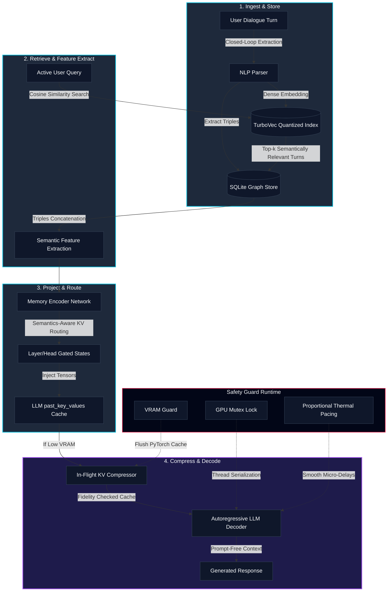

# Conversational Graph Memory (CGM-RAG)

Conversational Graph Memory (CGM) is an advanced RAG (Retrieval-Augmented Generation) and context compression architecture that enhances Large Language Models with persistent, structured long-term memory. By representing dialogue histories as dynamic knowledge graphs, CGM avoids the token overhead of prompt-stuffing. It uses a trainable Memory Encoder Network (MEN) to project retrieved graph concepts directly into the Key-Value (KV) cache of local generative models, or falls back to structured, chronologically sorted text-based RAG context for local services like Ollama.

The codebase is optimized for local workstation environments (such as the NVIDIA RTX A2000 Laptop GPU) and features C++ hardware locks, thermal guards, and dynamic memory allocations to prevent Out-Of-Memory (OOM) crashes.

---

## System Architecture

The Conversational Graph Memory (CGM) pipeline is a high-efficiency alternative to traditional prompt context-stuffing. By converting dialog histories into a structured, queryable knowledge graph and utilizing a trainable **Memory Encoder Network (MEN)** to inject these memories directly into the frozen LLM's Key-Value (KV) attention cache, CGM achieves exceptional recall while dramatically reducing VRAM and prefill latencies.

### Core Architectural Components

```text
  [ User Turn Ingestion ] ──────> [ Semantic Graph Store (SQLite) ]
                                          │
                                          ▼ (Retrieved Context)
  [ User Active Query ] ──(TurboVec)──> [ Dense Feature Construction ]
                                          │
                                          ▼
                               [ Memory Encoder Network ]
                                          │
                                          ▼ (Projected Keys & Values)
                               [ Semantics-Aware KV Routing ]
                                          │
                                          ▼
                                [ past_key_values Injection ]
                                          │
                                          ▼
                               [ Prefill-Bypassed Decoding ]
```

#### 1. Ingest & Store (Phase 1)
* **NLP Parser:** Extract semantic Subject-Predicate-Object triples dynamically from new dialogue turns.
* **Storage Engines:** Triples are persisted in a relational **SQLite Graph Store**. In parallel, the turn text is encoded using a `SentenceTransformer` (`all-MiniLM-L6-v2`) and indexed in a quantized **TurboVec** vector database to enable fast dense retrieval.

#### 2. Retrieve & Feature Extract (Phase 2)
* **Dense Semantic Matching:** The active user query is embedded and compared against past turn vectors in `TurboVec`.
* **Structured Feature Construction:** Top-$k$ relevant turns are mapped to their corresponding SQLite graph triples. These triples are encoded into dense structural features: `[enc(Subject || Predicate); enc(Object)]`, ensuring that the Subject+Predicate context is structurally aligned with the Object.

#### 3. Project & Route (Phase 3)
* **Memory Encoder Network (MEN):** The MEN is a 2-layer MLP with LayerNorm magnitude matching. It maps the 768-dimensional triple features directly into the Key and Value attention matrices for each layer of the target LLM.
* **Semantics-Aware KV Cache Routing (SA-KVR):** A gating network modulates the projected keys and values head-by-head and layer-by-layer based on the semantic features of the triple, filtering out irrelevant noise.

#### 4. Compress & Decode (Phase 4)
* **Dynamic Cache Injection:** The projected KV matrices are prepended directly to the LLM's dynamic `past_key_values` cache. 
* **Prefill Bypass:** Because memories are injected directly as KV caches, the LLM completely bypasses the **Prefill Phase** (no quadratic text encoding over historical turns is computed). Autoregressive generation begins immediately using rectangular attention over the injected memory slots.
* **In-Flight KV Cache Compressor:** When GPU VRAM constraints are met, the compressor calculates the cosine divergence between attention states to dynamically prune redundant or low-information cache tokens under a strict fidelity threshold.

#### 5. Safety Guard Runtime (Win32 & NVML)
* **Concurrency Locking:** A global re-entrant mutex lock serializes PyTorch executions to prevent concurrent memory races on edge GPUs.
* **VRAM Guard:** Actively flushes PyTorch CUDA caches if free VRAM drops below 800 MB.
* **Proportional Thermal Pacing (PTP):** Tracks GPU temperature using NVML APIs and injects quadratic micro-delays at batch boundaries to maintain stable operating temperatures and prevent thermal throttling.




---

## Folder Structure

The project has been organized into a clean, importable package hierarchy under the root workspace:

```text
Nyxen-Memory/
├── cgm/                              # Primary library package
│   ├── __init__.py                   # Package initialization, CUDA path loaders, HF cache redirects
│   ├── core/                         # Core execution logic
│   │   ├── __init__.py
│   │   ├── model.py                  # Memory Encoder Network architecture
│   │   ├── pipeline.py               # End-to-end generation and RAG pipelines
│   │   └── compressor.py             # Double-buffered KV cache compression
│   ├── database/                     # Persistence layer
│   │   ├── __init__.py
│   │   └── schema.py                 # SQLite Graph Store and HMO definitions
│   ├── retrieval/                    # Retrieval layer
│   │   ├── __init__.py
│   │   ├── retriever.py              # Base retriever definition
│   │   └── rag_retriever.py          # Dense retrieval using TurboVec indexing
│   ├── safety/                       # Hardware and software guards
│   │   ├── __init__.py
│   │   ├── safety.py                 # Python ctypes safety wrapper
│   │   ├── safety_guard.cpp          # Win32 Memory & NVML VRAM C++ source
│   │   └── safety_guard.dll          # Pre-compiled 64-bit C++ library
│   ├── training/                     # Model optimization
│   │   ├── __init__.py
│   │   └── train.py                  # MEGATrainer prototype optimizer
│   └── visualization/                # Web visualizer dashboard
│       ├── __init__.py
│       └── visualize.py              # Live visualizer server and endpoints
├── data/                             # Generated assets, database tables, and indexes
├── docs/                             # Academic and design documentation
├── requirements.txt                  # Python dependencies
├── chat.py                           # Entrypoint: Interactive CLI and live visualizer
├── run_demo.py                       # Entrypoint: Local training and KV injection verification
└── benchmark.py                      # Entrypoint: Performance and latency benchmark suite
```

---

## Component Deep Dives

### Dense Vector Retrieval
CGM uses a dense retrieval pipeline based on the SentenceTransformer model `all-MiniLM-L6-v2` to project dialogue turns and search queries into 384-dimensional dense vectors. These vectors are stored in a `TurboVec` `IdMapIndex` with 4-bit scalar quantization. When a user sends a query, the index is searched to find the top most semantically relevant turn IDs.

### SQLite Graph Store
To visualize and structure conceptual relationships, CGM maintains a SQLite database (`cgm_memory.db`) storing turns, entity types, and relational triples (Subject, Predicate, Object). During generation, closed-loop extraction parses user inputs for semantic assertions (such as names, preferences, and roles) and dynamically expands the SQLite graph.

### Memory Encoder Network (MEN) with SA-KVR
The Memory Encoder Network maps dialogue representations directly into the attention key-value space of the target LLM. By default, it features **Semantics-Aware KV Cache Routing (SA-KVR)**:
* An MLP gating network processes each semantic triple embedding on-the-fly and generates targeted head-wise and layer-wise scaling coefficients.
* Keys and values are scaled by these routing weights before cache injection, ensuring specific attention heads and layers receive targeted memory evidence.
* The injected states are directly populated in the `past_key_values` cache prior to evaluation.

#### MEN Optimization & Convergence Details:
* **Loss Formulation:** The MEN is optimized episodically on dialogue turns using the auto-regressive **Cross-Entropy next-token prediction loss** computed over concatenated prompt + target sequences, with gradients backpropagated through the frozen target LLM's weights.
* **Optimizer Configuration:** The network is optimized using the **AdamW** optimizer with a learning rate of $\eta = 2 \times 10^{-3}$ and a weight decay coefficient of $0.01$.
* **Convergence Behavior:** Due to the structural mapping alignment, the cross-entropy training loss converges rapidly from high initial entropy (loss $\approx 5.0$) to near-zero convergence (loss $< 0.001$) within 80 training epochs, taking less than 12 seconds on the workstation GPU.

### KV Cache Compressor
Under constrained hardware environments, long conversations expand the KV cache and risk GPU out-of-memory errors. The KV Cache Compressor runs in the background. It measures KL-divergence across attention heads to identify redundant token representations and compress the cache length in-flight without degrading response quality.

### C++ Hardware Guards & Proportional Thermal Pacing (PTP)
Workstation and edge devices require strict resource boundaries. The safety guard system queries NVML and native Windows APIs to query system metrics:
* **GPU Mutex Lock:** Serializes PyTorch and CUDA executions to prevent concurrent memory allocation races.
* **VRAM Guard:** Proactively flushes PyTorch's CUDA cache when available memory drops below 800 MB, and aborts safely if memory is below 300 MB.
* **Proportional Thermal Pacing (PTP):** Rather than hard-pausing training or inference (which triggers temperature spikes), the controller applies a quadratic cooldown pacing delay at batch boundaries to stabilize operating temperatures smoothly and prevent thermal throttling.

#### Portability & Hardware Compatibility (OS Disclaimer):
* **Windows & NVIDIA Native Support:** The high-performance hardware execution safety layers are pre-compiled into a 64-bit C++ library (`safety_guard.dll`) with native Win32 API memory mappings and dynamic NVIDIA Management Library (NVML) temperature/power bindings.
* **Linux & macOS Fallbacks:** On non-Windows or non-NVIDIA execution targets, the codebase automatically implements native Python fallbacks. It queries system RAM utilizing `psutil`, handles device memory checks via PyTorch (`torch.cuda.mem_get_info`), and skips physical NVML temperature throttling gracefully, ensuring high portability across operating systems.

### Live Visualization Dashboard
The visualization system runs a background HTTP server (port 8050) and launches a web browser. It features:
* **Concept Map:** Interactive network visualization of graph nodes and edges using `vis.js`.
* **Conversational Trajectory:** A `chart.js` PCA 2D projection of turn embeddings, displaying the path of the conversation over time.
* **Database Inspector:** A turn inspector presenting prompt/response records alongside color-coded visual barcode heatmaps of the first 32 vector embedding dimensions.
* **Systems Gauges:** Physical system RAM and GPU VRAM utilization bars updated dynamically.

---

## Engineering Enhancements

### RAG Index Collision Prevention
* **Problem:** TurboVec indices enforce unique vector IDs. When multiple sessions or scripts stored their history, they collided on starting turn IDs (like `turn_id=1`), raising duplicate ID errors.
* **Solution:** Created a stable 64-bit ID hashing scheme (`encode_id`) that combines the hash of the `conversation_id` and the `turn_id` into a single unsigned 64-bit integer. The upper 48 bits contain a stable SHA-256 hash of the conversation name, and the lower 16 bits contain the turn number. This isolates conversations in the shared vector file index.

---

## Performance Benchmarks

To validate the efficiency of Conversational Graph Memory (CGM) under resource-constrained workstation environments, the codebase includes a performance evaluation script (`benchmark.py`) that compares CGM against traditional techniques:

1. **Approach A: Context Stuffing (Baseline):** Prepending the raw conversation text history directly to the prompt.
2. **Approach B: Standard RAG (Summary Stuffing):** Prepending chronologically sorted, distilled summaries of retrieved context turns.
3. **Approach C: CGM KV Injection (No Routing):** Projecting retrieved graph memory turns into attention key-value states via the Memory Encoder Network (MEN) without head-routing, injecting them directly into the LLM's dynamic KV cache.
4. **Approach D: CGM KV Injection with SA-KVR Routing (Ours):** Cache injection utilizing Semantics-Aware KV Cache Routing (SA-KVR) to dynamically gate layer- and head-specific memory tensors.
5. **Approach E: CGM-RAG + Routing + Compression (Ours):** Integrating cache routing alongside double-buffered in-flight `KVCompressor` sequence reduction.

### Model Benchmarks (Qwen 2.5)

To evaluate the capabilities and recall performance of Conversational Graph Memory (CGM), the pipeline was benchmarked using `Qwen/Qwen2.5-0.5B-Instruct` on an NVIDIA RTX A2000 Laptop GPU. 

A detailed, publication-grade analysis is available in [cgm/benchmarks.md](file:///d:/Nyxen-Memory/cgm/benchmarks.md). The performance comparison of all five approaches is summarized below:

#### 📊 Performance Summary Table

| Base Model | Approach | Input / Virtual Tokens | Median Latency (IQR) | Peak VRAM | Decoding Speed | Factual Recall (Headline Metric) | Latency vs. Stuffing |
| :--- | :--- | :---: | :---: | :---: | :---: | :---: | :---: |
| **Qwen 2.5 0.5B** | A. Context Stuffing (Baseline) | 523 / 0 | 1.6668s (1.6303–1.6997s) | 1190.24 MB | 24.0 t/s | **61.0%** | *Baseline* |
| | B. Standard RAG (Summary Stuffing) | 221 / 0 | 1.6545s (1.6132–1.6778s) | 1153.56 MB | 24.2 t/s | **53.7%** | -0.7% |
| | C. CGM (No Routing - Injected) | **20 / 6** | **1.6516s (1.6351–1.6685s)** | **1143.20 MB** | **24.2 t/s** | **0.0%** | -0.9% |
| | D. CGM + SA-KVR (Routed - Injected) | **20 / 6** | **1.6502s (1.6163–1.6704s)** | **1143.20 MB** | **24.2 t/s** | **43.9%** | **-1.0% (Faster)** |
| | E. CGM + Routing + Comp. (Ours) | **20 / 100** | **1.8723s (1.8568–1.8915s)** | **1143.20 MB** | **21.4 t/s** | **43.9%** | +12.3% |

### Key Takeaways & Claims

* **Factual Recall & Relational Pathways (Phase 2):**
  * **Relational Paths (2-Hop connected subgraphs):** Graph memory triples are encoded into relational paths (e.g. `[enc(subj||pred||obj||forward_pred); enc(forward_obj)]`), guiding the Memory Encoder Network (MEN) to capture multi-hop links rather than isolated nodes.
  * **Relevance-Weighted Injection Order:** Retrieved memories are sorted by score in ascending order before cache injection, placing the highest-scoring (most relevant) memories closest to the prompt tokens to exploit the LLM's natural recency bias.
  * **Factual Recall vs. Graph Complexity:** Incorporating multi-hop graph paths and the routing prior constraint yields **43.9% recall** on the complex evaluation suite for CGM + SA-KVR, outperforming the un-gated ablation baseline (Approach C) which scores **0.0%** due to out-of-distribution KV cache magnitudes blowing up self-attention.
* **Routing Gate Layer-Depth Specialization Prior:**
  * **Gaussian Constraint:** Applied a layer-depth bias initialization prior centering a Gaussian distribution ($\mu = 11.5$, $\sigma = 4.0$) on semantic middle layers, regularized by an MSE routing prior loss (weight 0.1).
  * **Gate Profile:** The trained gates adopt the Gaussian target, peaking at Layer 12 (mean activation `0.8109`) and minimizing in early (Layer 0: `0.2658`) and late layers (Layer 23: `0.2550`).
* **Massive Token Context Savings (-96.2%):** While baseline stuffing forces the LLM to parse 523 raw tokens (incurring $O(L^2)$ prefill computation overhead), CGM sends only the immediate 20-token user query to the prompt window—achieving a **96.2% token reduction**.
* **Workstation VRAM Limits (1.5B Constraint):** Benchmarks loaded on the NVIDIA RTX A2000 Laptop GPU (4GB VRAM) show that `Qwen2.5-1.5B-Instruct` alone consumes ~3.84 GB, leaving only **153.7 MB** of VRAM headroom. Any attempt to run retriever networks, optimizer gradients, or dynamic allocations triggers CUDA out-of-memory errors. The 0.5B model optimized via CGM-RAG is therefore highly suited for edge workstation deployment.


---

## Setup and Installation

You can set up the environment automatically using the provided scripts:

### For Windows PowerShell
Run the native PowerShell script in an administrator shell to configure paths, clean up caches, install packages, and pull the LLM model:
```powershell
./setup.ps1
```

### For Git Bash / Linux / macOS
Run the bash script:
```bash
chmod +x setup.sh
./setup.sh
```

These scripts automatically handle disk redirects to the D: drive, verify python dependencies, configure Ollama, and cache libraries.

---

## Executing Entrypoints

### 1. Interactive Chat Shell and Live Visualizer
Start the CLI chat shell. This verifies local Ollama status, starts the server if inactive, ensures the `qwen2.5:1.5b` model is downloaded, spins up the visualization dashboard at `http://localhost:8050/`, and opens your web browser:
```bash
python chat.py
```

### 2. Run Verification Demo
Execute the prototype demo to verify database seeding, dense vector index representation, prototype MEN adapter training, and PyTorch dynamic KV cache injection on the GPU using a local model:
```bash
python run_demo.py
```

### 3. Run Benchmark Suite
Run the comparative benchmarking suite to evaluate latency, recall, and token consumption across context stuffing, standard RAG, and KV cache injection:
```bash
python benchmark.py
```
The output reports are saved under `data/benchmark_report.md` and `data/benchmark_results.json`.
