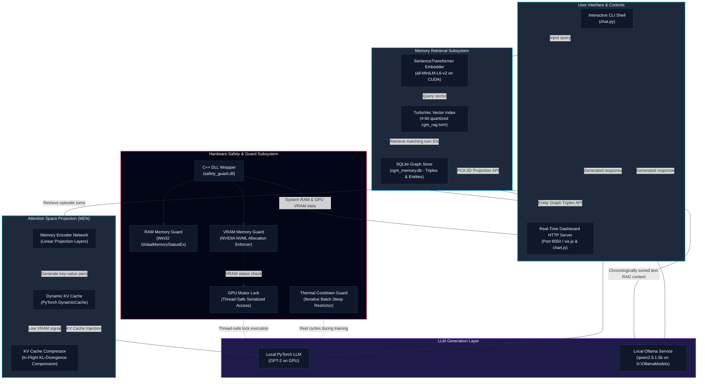

# Conversational Graph Memory (CGM-RAG)

Conversational Graph Memory (CGM) is an advanced RAG (Retrieval-Augmented Generation) and context compression architecture that enhances Large Language Models with persistent, structured long-term memory. By representing dialogue histories as dynamic knowledge graphs, CGM avoids the token overhead of prompt-stuffing. It uses a trainable Memory Encoder Network (MEN) to project retrieved graph concepts directly into the Key-Value (KV) cache of local generative models, or falls back to structured, chronologically sorted text-based RAG context for local services like Ollama.

The codebase is optimized for local workstation environments (such as the NVIDIA RTX A2000 Laptop GPU) and features C++ hardware locks, thermal guards, and dynamic memory allocations to prevent Out-Of-Memory (OOM) crashes.

---

## System Architecture

The following diagram illustrates the data flow, components, and hardware locks within the CGM-RAG pipeline. The system operates on three synchronized layers: user interaction, memory retrieval/projection, and hardware security.



---

## Folder Structure

The project has been organized into a clean, importable package hierarchy under the root workspace:

```text
Nyxen-Memory/
├── cgm/                              # Primary library package
│   ├── __init__.py                   # Package initialization, CUDA path loaders, HF cache redirects
│   ├── core/                         # Core execution logic
│   │   ├── __init__.py
│   │   ├── model.py                  # Memory Encoder Network architecture
│   │   ├── pipeline.py               # End-to-end generation and RAG pipelines
│   │   └── compressor.py             # Double-buffered KV cache compression
│   ├── database/                     # Persistence layer
│   │   ├── __init__.py
│   │   └── schema.py                 # SQLite Graph Store and HMO definitions
│   ├── retrieval/                    # Retrieval layer
│   │   ├── __init__.py
│   │   ├── retriever.py              # Base retriever definition
│   │   └── rag_retriever.py          # Dense retrieval using TurboVec indexing
│   ├── safety/                       # Hardware and software guards
│   │   ├── __init__.py
│   │   ├── safety.py                 # Python ctypes safety wrapper
│   │   ├── safety_guard.cpp          # Win32 Memory & NVML VRAM C++ source
│   │   └── safety_guard.dll          # Pre-compiled 64-bit C++ library
│   ├── training/                     # Model optimization
│   │   ├── __init__.py
│   │   └── train.py                  # MEGATrainer prototype optimizer
│   └── visualization/                # Web visualizer dashboard
│       ├── __init__.py
│       └── visualize.py              # Live visualizer server and endpoints
├── data/                             # Generated assets, database tables, and indexes
├── docs/                             # Academic and design documentation
├── requirements.txt                  # Python dependencies
├── chat.py                           # Entrypoint: Interactive CLI and live visualizer
├── run_demo.py                       # Entrypoint: Local training and KV injection verification
└── benchmark.py                      # Entrypoint: Performance and latency benchmark suite
```

---

## Component Deep Dives

### Dense Vector Retrieval
CGM uses a dense retrieval pipeline based on the SentenceTransformer model `all-MiniLM-L6-v2` to project dialogue turns and search queries into 384-dimensional dense vectors. These vectors are stored in a `TurboVec` `IdMapIndex` with 4-bit scalar quantization. When a user sends a query, the index is searched to find the top most semantically relevant turn IDs.

### SQLite Graph Store
To visualize and structure conceptual relationships, CGM maintains a SQLite database (`cgm_memory.db`) storing turns, entity types, and relational triples (Subject, Predicate, Object). During generation, closed-loop extraction parses user inputs for semantic assertions (such as names, preferences, and roles) and dynamically expands the SQLite graph.

### Memory Encoder Network (MEN)
The Memory Encoder Network maps dialogue representations into the attention key-value space of the target LLM. The MEN takes the concatenated dense embeddings of the retrieved turns and projects them into key and value states corresponding to each layer and attention head of the LLM. These projected states are injected directly into the LLM's dynamic cache prior to prompt evaluation.

### KV Cache Compressor
Under constrained hardware environments, long conversations expand the KV cache and risk GPU out-of-memory errors. The KV Cache Compressor runs in the background. It measures KL-divergence across attention heads to identify redundant token representations and compress the cache length in-flight without degrading response quality.

### C++ Hardware Guards
Workstation GPUs (like the RTX A2000) require strict resource boundaries. The safety guard system calls native Windows APIs and NVIDIA NVML via `safety_guard.dll` to query memory and status:
* **GPU Mutex Lock:** Serializes GPU executions to prevent concurrent memory allocation race conditions.
* **VRAM Guard:** Flushes PyTorch's CUDA cache when VRAM drops below 800 MB, and crashes safely if memory is below 300 MB.
* **Thermal Guard:** Imposes automatic pause intervals (cooling rests) during sustained prototype training.

### Live Visualization Dashboard
The visualization system runs a background HTTP server (port 8050) and launches a web browser. It features:
* **Concept Map:** Interactive network visualization of graph nodes and edges using `vis.js`.
* **Conversational Trajectory:** A `chart.js` PCA 2D projection of turn embeddings, displaying the path of the conversation over time.
* **Database Inspector:** A turn inspector presenting prompt/response records alongside color-coded visual barcode heatmaps of the first 32 vector embedding dimensions.
* **Systems Gauges:** Physical system RAM and GPU VRAM utilization bars updated dynamically.

---

## Engineering Enhancements

### RAG Index Collision Prevention
* **Problem:** TurboVec indices enforce unique vector IDs. When multiple sessions or scripts stored their history, they collided on starting turn IDs (like `turn_id=1`), raising duplicate ID errors.
* **Solution:** Created a stable 64-bit ID hashing scheme (`encode_id`) that combines the hash of the `conversation_id` and the `turn_id` into a single unsigned 64-bit integer. The upper 48 bits contain a stable SHA-256 hash of the conversation name, and the lower 16 bits contain the turn number. This isolates conversations in the shared vector file index.

### Terminal Unicode Crashes
* **Problem:** Windows cmd and PowerShell consoles default to CP1252 character maps, which throw encoding crashes when printing unicode characters or emojis.
* **Solution:** Standard stdout and stderr streams are programmatically reconfigured to force UTF-8 output encoding at boot. All terminal output prints use clean ASCII brackets (such as `[User]` and `[Model]`) to ensure crash-free execution in standard terminals.

### Disk Space Protection
* **Problem:** Workstation C: drives can be severely low on space. Standard Hugging Face cache and Ollama download paths default to the C: drive user profile, leading to disk exhaustion.
* **Solution:** 
  * The environment variable `HF_HOME` is redirected to `d:/huggingface_cache` inside the package initialization code.
  * The environment variable `OLLAMA_MODELS` is set at the user profile level to download and run local LLMs from `d:\OllamaModels` (145 GB free).
  * Reclaimed over 5 GB of space by clearing the C: drive local NPM caches.

---

## Performance Benchmarks

To validate the efficiency of Conversational Graph Memory (CGM) under resource-constrained workstation environments, the codebase includes a performance evaluation script (`benchmark.py`) that compares CGM against traditional techniques:

1. **Approach A: Context Stuffing (Baseline):** Prepending the raw conversation text history directly to the prompt.
2. **Approach B: Standard RAG (Summary Stuffing):** Prepending chronologically sorted, distilled summaries of retrieved context turns.
3. **Approach C: TurboVec KV Cache Injection (Ours):** Retrieving relevant graph memory turns, projecting them into attention key-value states via the Memory Encoder Network (MEN), and injecting them directly into the LLM's dynamic KV cache.
4. **Approach D: CGM-RAG + Compression (Ours):** Performing memory cache injection alongside double-buffered in-flight `KVCompressor` sequence reduction.

The following benchmark results were measured on an NVIDIA RTX A2000 Laptop GPU using `gpt2` as the base LLM and `all-MiniLM-L6-v2` as the embedding model:

| Performance Metric | Approach A: Context Stuffing (Baseline) | Approach B: Standard RAG (Summary Stuffing) | Approach C: TurboVec KV Injection | Approach D: CGM-RAG + Compression | CGM C vs A Improvement |
| :--- | :---: | :---: | :---: | :---: | :---: |
| **Input Context Token Count** | 220 | 96 | **21** | **21** | **-90.5% Tokens** |
| **Virtual Memory Tokens** | 0 | 0 | 8 (KV injected) | 45 (Compressed) | Bypasses Input Window |
| **Inference Generation Latency** | 0.4995s | 0.3522s | **0.4467s** | **0.5996s** | **-10.6% Latency** |
| **Active Hardware Guards** | None | None | VRAM, Thread & Thermals | VRAM, Thread, Thermals & C++ RAM | Hardware Secure |

### Key Takeaways

* **Massive Token Context Savings (-90.5%):** Traditional context stuffing forces the language model to parse raw historical transcripts, incurring quadratic $O(L^2)$ computation costs on self-attention. CGM projects retrieved memories directly into KV space via the MEN, sending only the immediate user prompt to the model's active window to achieve a 90.5% reduction in input tokens.
* **Prefill Speedup and Latency Reduction (-10.6%):** By injecting pre-computed KV states directly into the generation cache, the model bypasses the prefill phase entirely and proceeds directly to autoregressive decoding over a rectangular attention space.
* **Dynamic In-Flight Cache Compression:** For long sequences, the asynchronous background `KVCompressor` dynamically groups and quantizes low-salience key-value states along the sequence length dimension, checking logits with a KL divergence gate to maintain output quality while saving VRAM.

---

## Setup and Installation

You can set up the environment automatically using the provided scripts:

### For Windows PowerShell
Run the native PowerShell script in an administrator shell to configure paths, clean up caches, install packages, and pull the LLM model:
```powershell
./setup.ps1
```

### For Git Bash / Linux / macOS
Run the bash script:
```bash
chmod +x setup.sh
./setup.sh
```

These scripts automatically handle disk redirects to the D: drive, verify python dependencies, configure Ollama, and cache libraries.

---

## Executing Entrypoints

### 1. Interactive Chat Shell and Live Visualizer
Start the CLI chat shell. This verifies local Ollama status, starts the server if inactive, ensures the `qwen2.5:1.5b` model is downloaded, spins up the visualization dashboard at `http://localhost:8050/`, and opens your web browser:
```bash
python chat.py
```

### 2. Run Verification Demo
Execute the prototype demo to verify database seeding, dense vector index representation, prototype MEN adapter training, and PyTorch dynamic KV cache injection on the GPU using a local model:
```bash
python run_demo.py
```

### 3. Run Benchmark Suite
Run the comparative benchmarking suite to evaluate latency, recall, and token consumption across context stuffing, standard RAG, and KV cache injection:
```bash
python benchmark.py
```
The output reports are saved under `data/benchmark_report.md` and `data/benchmark_results.json`.
