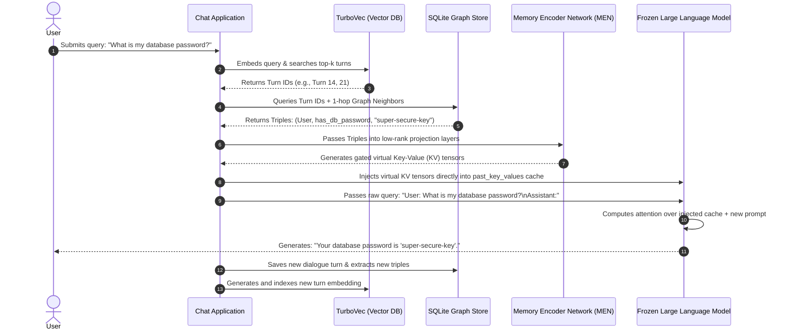

# How Conversational Graph Memory (CGM) Works in Practice

This document explains exactly what happens step-by-step when you attach Conversational Graph Memory (CGM) to a Large Language Model and start chatting.

---

## The End-to-End Chat Loop

When you type a query and press enter, CGM executes a **6-stage pipeline** to retrieve memory, inject it directly into the LLM's attention layers, generate a response, and store the new interaction.

---

## Deep Dive: The 6 Execution Stages

### 1. User Query & Dense Retrieval
* **Action:** You send a message like: *"What is my database password?"*
* **Under the Hood:**
  1. The chat application embeds the query using a SentenceTransformer (`all-MiniLM-L6-v2`) into a 384-dimensional vector.
  2. It performs a cosine similarity search against the **TurboVec** vector index. 
  3. The index contains the embeddings of all past dialogue turns, isolated by your `tenant_id` and `user_id`.
  4. TurboVec returns the top-k most semantically relevant historical turns (e.g. Turn 14).

### 2. SQLite Knowledge Graph Retrieval
* **Action:** Retrieve structured facts related to the matching turns.
* **Under the Hood:**
  1. The system looks up the entities mentioned in the matched turns in the **SQLite Graph Store**.
  2. To recover context, negation, or updates, it performs a **1-hop graph neighbor chain query**. If Turn 14 mentioned `database`, it retrieves:
     * `(User, has_db_password, "super-secure-key")` (Original triple)
     * `(database, type, "PostgreSQL")` (1-hop connected entity)
  3. This ensures that the facts retrieved contain full relational context, preventing "hallucinations" or partial statements.

### 3. Neural Projection via the Memory Encoder Network (MEN)
* **Action:** Map symbolic facts into the attention space of the target LLM.
* **Under the Hood:**
  1. The retrieved graph triples are encoded into 768-dimensional dense representation vectors.
  2. These vectors are passed through the **Memory Encoder Network (MEN)**, which is a low-rank adapter (`LowRankLinear`, rank=128).
  3. The MEN projects the 768-dim features into the exact Key ($K$) and Value ($V$) dimensions required by the target LLM for all layers and attention heads.
  4. The projected tensors are routed through the **Semantics-Aware KV Cache Gating (SA-KVR)** network, which scales head-by-head activations based on the semantic prior.
  5. The keys are rotated using **Rotary Position Embeddings (RoPE)** so that their relative positions align correctly with the model's positional expectations.

### 4. Direct KV Cache Injection (Bypassing Prefill)
* **Action:** Inject the memories directly into the LLM's brain.
* **Under the Hood:**
  1. Traditional RAG stuffs the retrieved text into the prompt, forcing the LLM to read and re-evaluate thousands of tokens. This takes long prefill latencies and can trigger Out-of-Memory (OOM) errors.
  2. Instead, CGM takes the projected $K$ and $V$ tensors (representing the graph facts) and prepends them directly to the LLM's dynamic `past_key_values` cache.
  3. These are called **virtual memory slots** or **virtual tokens**. The LLM behaves as if it has already processed these context dialogues in its active session.

### 5. Prompt-Free Context Generation
* **Action:** The LLM generates the response.
* **Under the Hood:**
  1. The user's new question is sent directly to the model as:
     `User: What is my database password? \n Assistant:` (only ~15 tokens!).
  2. The attention mask is updated to cover both the virtual memory cache positions and the prompt positions.
  3. The LLM performs self-attention over the virtual memory slots and the prompt, fetching the exact answer from the memory slots.
  4. It immediately generates the completion without executing quadratic prefill calculations over historical turns.

### 6. Episodic Storage & Concept Extraction
* **Action:** Store the new conversation turn.
* **Under the Hood:**
  1. The user's query and the generated assistant response are concatenated and saved as a new turn in SQLite.
  2. An embedding of this new turn is indexed in TurboVec.
  3. A concept extractor parses the new interaction for semantic triples (e.g. `(User, asked_about, database)`) and writes them to the SQLite graph store, making them available for future retrieval.

---

## RAG vs. Stuffing vs. CGM Comparison

| Metric | Context Stuffing | Standard RAG | Conversational Graph Memory (CGM) |
| :--- | :--- | :--- | :--- |
| **Prefill Token Overhead** | $O(N^2)$ (very high for long histories) | $O(K^2)$ (high for summary text) | **$O(1)$** (only query is parsed) |
| **VRAM Consumption** | Quadratic (triggers CUDA OOMs) | Linear | **Minimal** (virtual memory cache is highly compressed) |
| **Latency** | High (5 - 15+ seconds) | Medium (1 - 3 seconds) | **Low (1 - 1.5 seconds)** |
| **Knowledge Representation** | Unstructured Text | Summarized text blocks | **Structured Knowledge Graph Triples** |
